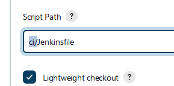

<h4>Creating a pipeline from scratch using Jenkins and GitLab</h4>

Go to Dashboard and click the ```+ New Item``` selection


Enter a name for your pipeline, and select ```Pipeline``


Scroll down to build triggers and click ```Build when a change is pushed to GitLab```


Now head to your GitLab repository and click ```Settings > Webhooks```


Head back to Jenkins, and copy the GitLab webhook URL


Head back to your GitLab Webhooks, and paste the URL into the bar

Make sure to change ```http://``` into ```https://```


Scroll down and click ```Advanced```


Continue scrolling down until you see ```Secret Token``` then click ```Generate```

Copy the token to your clipboard


Head back to GitLab Webhooks and paste the secret token in


Scroll down and click ```Add Webhook```


Go back to Jenkins, scroll down to the Pipeline section

Select ```Pipeline script from SCM```


Select ```Git```


Select your credentials


Go back to GitLab Repository, go to ```Clone``` and copy ```Clone with HTTPS```


Paste it into Repository URL


Scroll down to ```Branches to build``` and change the default ```*/master``` into ```*/main```


Scroll down to script path and change the default ```Jenkinsfile``` to ```ci/Jenkinsfile```



Now as long as you have a Jenkinsfile at ```ci/Jenkinsfile``` in your GitLab repisitory, the pipeline should run on any git commit

